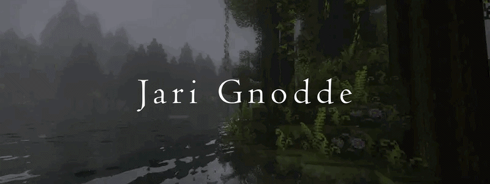
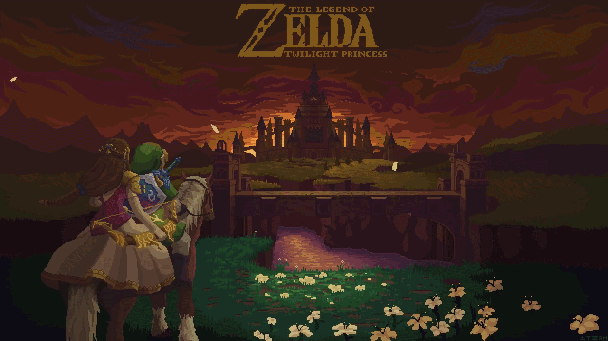

  

---

# 💫 About Me
- Hi! I'm **Jari Gnodde** 👋 
  I'm 17 years old and currently studying Software Development at Firda College. 
  I enjoy being creative and expressing ideas through art, music, and technology.

  In my free time I play games (a lot), practice piano, and create art in real life — so bringing all of that into the digital world felt natural. 

  Right now I'm focused on learning coding, web development, digital art, and game development. 
  I'm constantly improving while balancing school and personal projects, aiming to grow into a well-rounded creative developer.
---

## 📊 Skills & Stats

<table>
<tr>
<td width="50%" valign="top">
  
### 💻 Familiar With

#### 👨‍💻 Languages

#### 🌐 Web

#### 🎮 Game Dev & Art

</td>

<td width="50%" valign="top">
  
### 📊 GitHub Stats

</td>
</tr>
</table>

---

## 🚀 Currently Learning / Projects
- I'm currently building my own portfolio using React + Vite + TailwindCSS. 
  When it's finished, it will be available here: 
  🌐 Portfolio: *[My Portfolio](https://your-link-here.com)*

- I'm also learning C#, not just for general programming but specifically for game development. 
  I chose Godot as my starting engine because it's open-source and beginner-friendly.

- At the same time, I'm continuously improving through school and hands-on projects — applying everything listed in my Skills section*
---
## ⚜️ Finished Projects:
- In progress :)
---

  

---

## 🎮 Game Development Journey
- I'm currently starting my indie dev journey 🚀 
  I chose Godot because it's open-source and a great environment to learn C#, game design, and development workflows.

  My goal is to combine:
  - 🎮 Game mechanics  
  - 🎨 Visual art  
  - 🎵 Music  

  Into complete, original game experiences.

---

## 📚 Other Things I'm Learning
- 🎹 Practicing and improving my piano skills daily  
- 🎨 Exploring new art styles and improving consistency  
- 🧠 Learning how to turn ideas into actual finished projects  
- ⚙️ Understanding how games are structured behind the scenes  

---

──────────── ✦ ────────────

